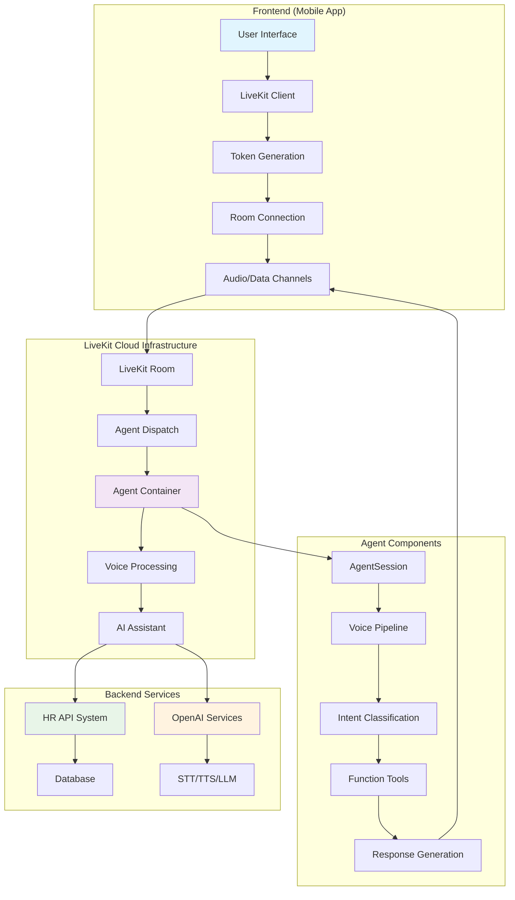
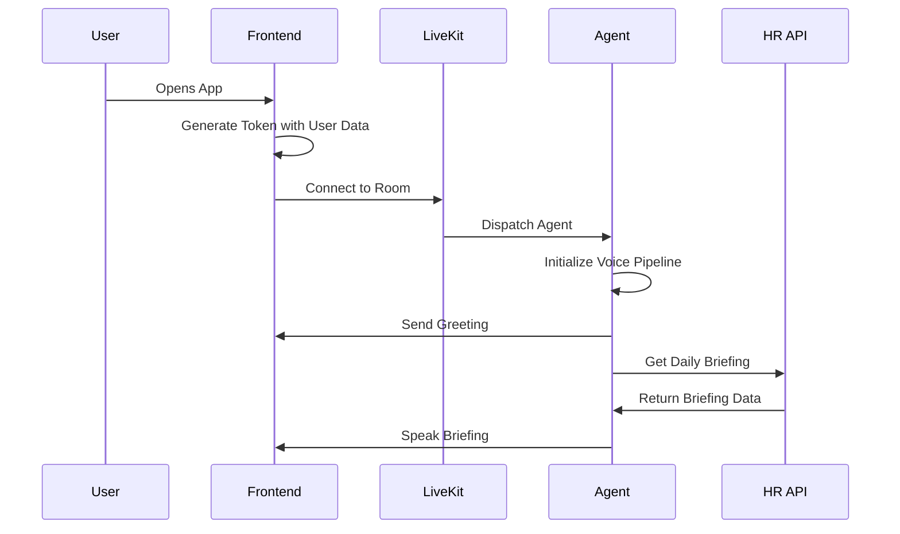
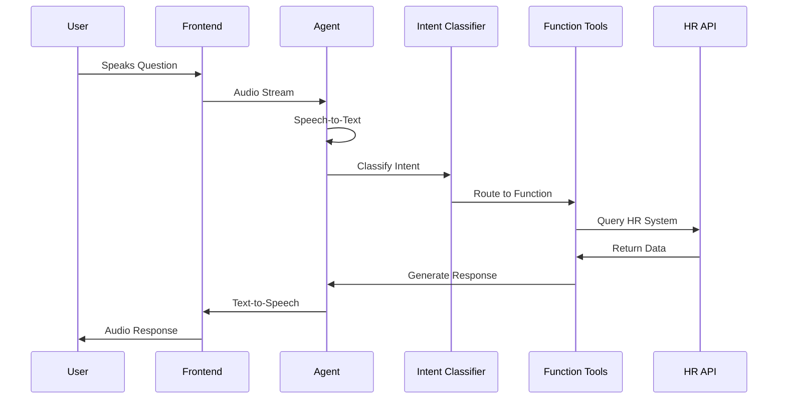

# HR Voice Assistant - Architecture & Workflow Guide

## 🏗️ System Architecture Overview



## 🔄 Complete Workflow

### 1. **Initialization Phase**


### 2. **User Interaction Flow**


## 📁 Project Structure

```
mobile_hr_worker/
├── agent.py                 # Main agent implementation
├── livekit.toml            # LiveKit configuration
├── requirements.txt        # Python dependencies
├── Dockerfile             # Container configuration
├── secrets.env            # Environment variables
├── ARCHITECTURE_WORKFLOW.md # This file
├── DYNAMIC_USER_ID_GUIDE.md # User ID system guide
├── AUTOMATIC_GREETING_GUIDE.md # Greeting system guide
└── INTERMEDIATE_MESSAGING_GUIDE.md # Messaging system guide
```

## 🔧 Core Components

### **1. Agent Session (`agent.py`)**
- **Purpose**: Main voice AI pipeline
- **Key Functions**:
  - `entrypoint()`: Initializes agent and starts voice pipeline
  - `get_daily_briefing()`: Retrieves daily HR updates
  - `query_hr_system()`: Handles HR-related queries
  - `send_automatic_greeting()`: Welcomes users on connection

### **2. Intent Classification System**
- **Purpose**: Routes user queries to appropriate handlers
- **Intents**:
  - `daily_briefing`: Requests for daily updates
  - `hr_query`: General HR questions
  - `help`: Assistance requests
  - `complaint`: Issue reporting
  - `appreciation`: Positive feedback

### **3. Dynamic User ID System**
- **Purpose**: Passes user-specific data from frontend to agent
- **Components**:
  - Token metadata embedding
  - Data channel communication
  - User configuration management

### **4. Voice Processing Pipeline**
- **STT**: OpenAI Whisper for speech-to-text
- **LLM**: GPT-4o-mini for natural language processing
- **TTS**: OpenAI TTS for text-to-speech
- **VAD**: Silero for voice activity detection

## 🚀 Development Workflow

### **Daily Development Process**

1. **Code Changes**
   ```bash
   # Make changes to agent.py
   # Test locally if needed
   git add .
   git commit -m "Description of changes"
   git push
   ```

2. **Deploy to LiveKit**
   ```bash
   lk agent deploy
   ```

3. **Test in Production**
   ```bash
   # Create test room
   lk room create --name "test-room"
   
   # Dispatch agent
   lk dispatch create --room test-room --agent-name CA_9ptBUymQxjAx
   
   # Check logs
   lk agent logs CA_9ptBUymQxjAx
   ```

### **Troubleshooting Workflow**

1. **Check Agent Status**
   ```bash
   lk agent status CA_9ptBUymQxjAx
   ```

2. **View Logs**
   ```bash
   lk agent logs CA_9ptBUymQxjAx
   ```

3. **Check Room Status**
   ```bash
   lk room list
   ```

4. **Redeploy if Needed**
   ```bash
   lk agent deploy
   ```

## 🔑 Key Configuration Files

### **livekit.toml**
```toml
[agent]
id = "CA_9ptBUymQxjAx"
subdomain = "missionmind-gl3d4ero"
min_replicas = 1
max_replicas = 1
idle_timeout = 0
keep_alive = true
```

### **secrets.env**
```env
LIVEKIT_URL=wss://missionmind-gl3d4ero.livekit.cloud
LIVEKIT_API_KEY=your_api_key
LIVEKIT_API_SECRET=your_api_secret
OPENAI_API_KEY=your_openai_key
HR_API_BASE_URL=your_hr_api_url
HR_API_ENDPOINT=/api/chat
```

## 🎯 Common Tasks & Commands

### **For New Team Members**

1. **Setup Environment**
   ```bash
   # Clone repository
   git clone https://github.com/vikky-2001/hr-voice-assistant.git
   cd hr-voice-assistant
   
   # Install LiveKit CLI
   # Follow: https://docs.livekit.io/realtime/cli/
   
   # Authenticate
   lk cloud auth
   ```

2. **Deploy Agent**
   ```bash
   lk agent deploy
   ```

3. **Test Agent**
   ```bash
   # Create room
   lk room create --name "test-room"
   
   # Dispatch agent
   lk dispatch create --room test-room --agent-name CA_9ptBUymQxjAx
   ```

### **For Debugging**

1. **Check Agent Logs**
   ```bash
   lk agent logs CA_9ptBUymQxjAx --follow
   ```

2. **Monitor Room Activity**
   ```bash
   lk room list
   ```

3. **Check Dispatch Status**
   ```bash
   lk dispatch list test-room
   ```

## 🔄 Data Flow Architecture

### **User Data Flow**
1. **Frontend** → Generates token with user metadata
2. **LiveKit** → Establishes secure connection
3. **Agent** → Receives user data via data channels
4. **HR API** → Queries with user-specific information
5. **Response** → Personalized results sent back to user

### **Voice Processing Flow**
1. **Audio Input** → STT converts to text
2. **Text Processing** → Intent classification
3. **Function Routing** → Appropriate handler called
4. **API Query** → HR system queried
5. **Response Generation** → LLM creates response
6. **Audio Output** → TTS converts to speech

## 🛠️ Development Best Practices

### **Code Organization**
- Keep functions focused and single-purpose
- Use descriptive function names
- Add comprehensive logging
- Handle errors gracefully

### **Testing Strategy**
- Test locally when possible
- Use staging rooms for testing
- Monitor logs during development
- Test with real user scenarios

### **Deployment Strategy**
- Always test before deploying
- Use descriptive commit messages
- Monitor deployment logs
- Have rollback plan ready

## 📊 Monitoring & Observability

### **Key Metrics to Monitor**
- Agent response time
- Voice processing latency
- HR API response time
- User satisfaction (via logs)
- Error rates

### **Log Analysis**
```bash
# Filter for errors
lk agent logs CA_9ptBUymQxjAx | grep ERROR

# Filter for specific function
lk agent logs CA_9ptBUymQxjAx | grep "get_daily_briefing"

# Monitor real-time
lk agent logs CA_9ptBUymQxjAx --follow
```

## 🚨 Common Issues & Solutions

### **Agent Not Connecting**
1. Check agent status: `lk agent status CA_9ptBUymQxjAx`
2. Verify room exists: `lk room list`
3. Check dispatch: `lk dispatch list room-name`
4. Redeploy if needed: `lk agent deploy`

### **Slow Response Times**
1. Check HR API connectivity
2. Monitor OpenAI API limits
3. Review timeout settings
4. Check network latency

### **Voice Issues**
1. Verify audio codecs in room
2. Check STT/TTS configuration
3. Test with different audio inputs
4. Review VAD settings

## 📚 Additional Resources

- [LiveKit Documentation](https://docs.livekit.io/)
- [OpenAI API Documentation](https://platform.openai.com/docs)
- [Project GitHub Repository](https://github.com/vikky-2001/hr-voice-assistant)
- [Dynamic User ID Guide](./DYNAMIC_USER_ID_GUIDE.md)
- [Automatic Greeting Guide](./AUTOMATIC_GREETING_GUIDE.md)
- [Intermediate Messaging Guide](./INTERMEDIATE_MESSAGING_GUIDE.md)

---

**Last Updated**: January 12, 2025  
**Version**: 1.0  
**Maintainer**: Development Team
